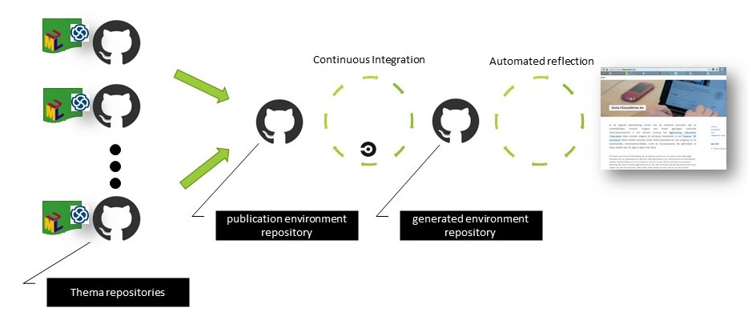

# OSLO-publicationenvironment-template
This is a template for the OSLO publication environment.

The version of this template is found in [config/config.json](./config/config.json).

This template forms the boilerplate for the publication environment.
The repository [OSLOthema-template](https://github.com/Informatievlaanderen/OSLOthema-template) is a boilerplate template for the OSLOthema repositories.

The objective of an instance of this template is to automate the publication of the data specifications in a static website. 
The data specification are managed in separate thema repositories.
Separating the data specifications content from the publication environment creates flexibility and scaling potential, without losing a central control.
The content of the static website is available in the generated repository.
The operational deployment the static website is indepedent from, and beyond the configuration of this repository.
A _possible_ setup is described in a separate [chapter](./documentation/README.md).

## deployment instructions
After the template has initiated a publication environment, the setup has to be completed with additional configuration.

1. Create the corresponding generated repository. A plain empty repository is sufficient
2. Read the configuration instructions in
    - [config/README.md](./config/README.md)
    - [.circleci/README.md](./.circleci/README.md)
3. Follow the instructions and adapt and setup the configurations for one hostname (e.g. for the development hostname) 
    - adapt thus the configuration files to your context
    - activate CircleCI processing
4. Select a demo thema repository containing a valid data specification for testing purposes, and configure the first publication point.
5. address any technical error, until the demo publication point is successfully processed and resulted in an expected commit in the generated repository.
6. remove any boilerplate documentation files that is superflusious.

## versioning and development

1. Create a new branch with the new version number. By preference starting from the branch with the previous version number.
2. Bump the version number in the Changelog and config/config.json
3. Make your changes

Releasing and merging into the main branch are to be discussed.
