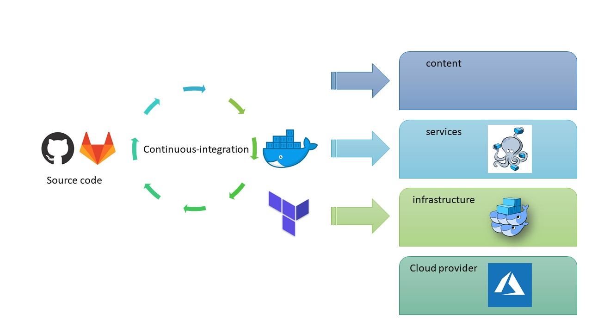
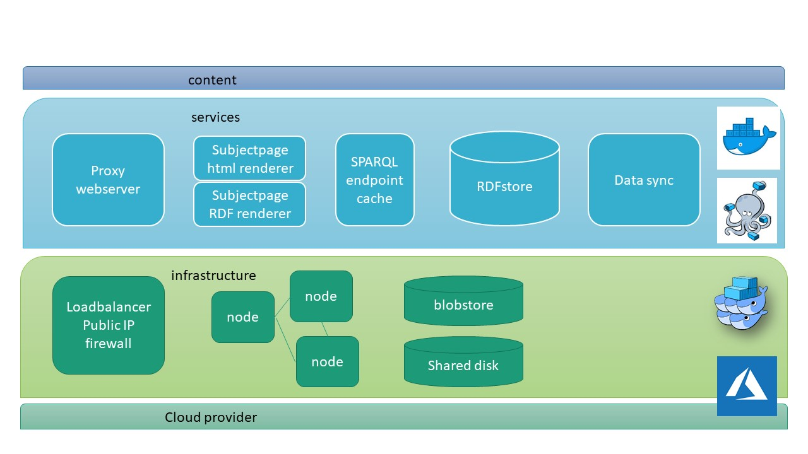
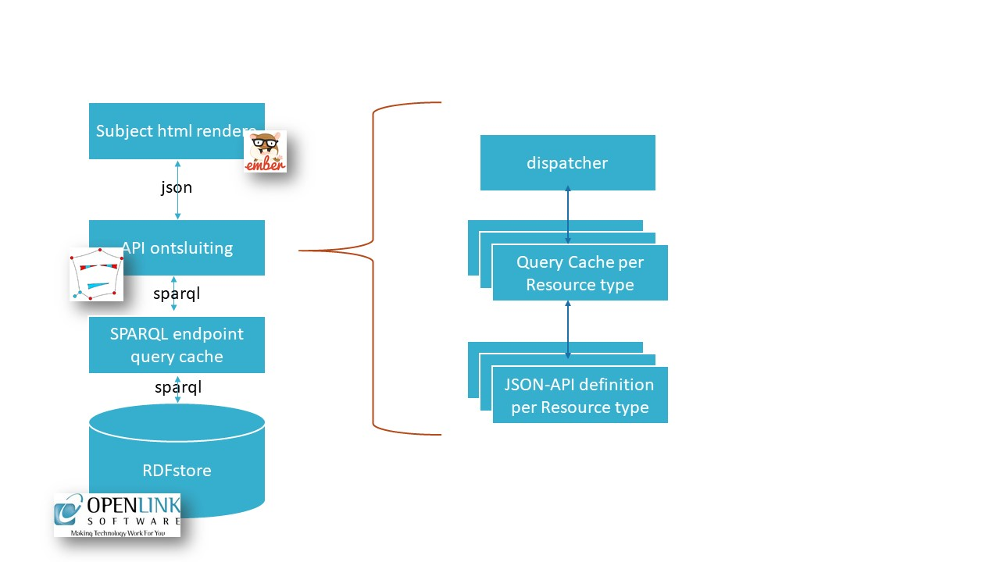

# Publication environment operational architecture

The publication environment has been setup to minimize the rollout and maintenance effort of any change to the system in a predicatable way. 
Whereas most of the configuration in this repository has to do with the way how the artifact generation process is done,
this documentation describes the publication environment that will consume the generated repository.

The usage of this environment is optional, but since the design of the publication environment is done to automate the complete flow from editor to publication it is relevant to add this documentation.

The components of this setup are also available on request at https://data.vlaanderen.be. 
They are build on Open Source software.

## Deployment operational design 

The figure below shows the four layers of the environment. 

The bottom layer is the cloud infrastructure. For https://data.vlaanderen.be this is [Azure](https://azure.microsoft.com/). 

On top of that, the infrastructure is deployed. The infrastructure is setup using [Terraform](https://www.terraform.io/). 
The terraform configuration describes a [docker swarm](https://github.com/docker/swarm) setup.
Docker swarm is native clustering for Docker. Docker swarm is responsible for executing the services of data.vlaanderen.be.
It monitors the health of the services. In case problems are detected docker swarm will try to respawn the malfunctioning service 
in order to restore the application.

The application itself is controlled by a docker-compose description. The docker-compose description is an infrastructure neutral 
description of the application. It details how the services are connected with eachother. When developing on the services, the code 
is pushed in the source control system (github.com and a local gitlab instance ). The automation triggers a build (of a new docker instance of the services) 
and testing of the build.  When the code change passes all checks, it can be committed to the master branch and tagged. The tagged
docker service can now be activated in the docker-compose description. Any change to the docker-compose description is automatically 
deployed on the infrastructure.  The use of branches and tags allows to precisely document which service is running on which environment.

The final layer is the data content layer. For having a life system with the correct content the data has to be uploaded. Some data is comming from external systems 
and will be retrieved by querying them. But other data such as the static html pages will be retrieved from source control. The service will regulary 
poll for changes; when a change is detected the existing data of the service is replaced. Content editors hence follow the same approach as
the software development.

## The application component architecture

The application component architecture is depicted in the figure below. 

At the infracture layer, descriped by a terraform description,  there has been setup a loadbalancer. It is the entrypoint for all 
traffic between the external world (the Internet) and the internal services.
To run the services a cluster of 4 nodes has been created. 
It consists of 3 master nodes and 1 larger worker node. 
It is the RDFstore component that has substantial different resource requirements (disk, memory) than the other components. 
By component pinning we enforce that the RDFstore will run on the larger worker node.
This setup gives a minimal amount of robustness, currently sufficient for our needs. 
But it can be easily increased when required by interacting with terraform. 
The shared disk is used to share data across all nodes, such as the tls cerficates. 
Finally we also added a blobstore for storing large datasets.

The application layer shows the key components of the application.
A proxy which handles the content-negoration. The proxy is the only service that is accesssible from the public network.
It also offers access to webservices to render the static html pages. Next it contains the html 
and RDF renderers for the subjectpages, which data comes from a SPARQL endpoint. The SPARQL endpoint is accessed through a query cache. 
And then the key data provider: the RDF store, which also serves the SPARQL endpoint. 

The RDFstore data is fed by the data synchronisation service.

To monitor the health of the running services, all logs are shipped to an external system. This enables to follow the activity on the system
while not loading that on the system itself.

Note that our infrastructure has been setup with a *readonly* system in mind. On disaster, a completely new setup can be created within the hour. The setup hence balances the need for robustness and the amount of work to recover in case of a disaster.

## The html subjectpage renderer 
The html subjectpage renderer itself is a complicated setup, consisting of serveral services.

Its implementation is based on the [mu.semte.ch ecosystem](https://github.com/mu-semtech). Using the mu.resources service, for a given resource, the RDF data is retrieved from the 
SPARQL endpoint and turned into a JSON-API compliant representation. The JSON-API resource api is used in by Single Page Application to create the subject pages.
For each resource type (e.g. Address, Building, Organisation) a mu.resources configuration has to be made.

An experimental artifact generators for this ecosystem is set available at [mu.semte.ch configuration generator](https://github.com/Informatievlaanderen/OSLO-SpecificationGenerator/blob/multigual-dev/mu-config-generator.js).

## Maintenance experience

The same configuration has been operational since 2019.
During that period the operational maintenance of the services required minimal human intervention, while still new services where upgraded, reconfigured, etc. 
When downtime was reported, it never occurred that the whole website was down, but that due to the decomponsition in (micro)services the site alwyas at least partially available.
It shows that this way of working allowed to keep the operational costs close to the cloud provisioning costs.
